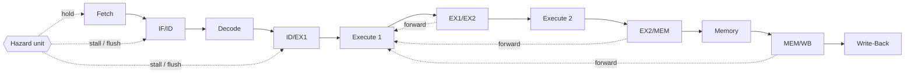

# 6-Stage Pipelined RISC Processor

A 32-bit RISC processor in VHDL with a six-stage pipeline, full data forwarding, a hazard unit, interrupts, and a Python assembler. It's simulated in ModelSim.

## Overview

- **Pipeline:** Fetch → Decode → Execute 1 → Execute 2 → Memory → Write-Back
- **Registers:** 8 general-purpose 32-bit registers (`R0`–`R7`). The register file has two write ports, so `SWAP` completes in a single write-back.
- **Memory:** a single unified (Von Neumann) memory of 4096 × 32-bit words, shared by instructions and data.
- **Flags:** a condition code register with Zero, Negative and Carry.
- **Stack:** the stack pointer starts at the top of memory (`0xFFF`) and is used by `PUSH`/`POP`, `CALL`/`RET` and interrupts.
- **I/O:** 32-bit input and output ports, plus an external interrupt pin.
- **Vectors:** words 0–3 of memory hold the reset address, the external interrupt address, and the `INT 0` and `INT 1` handler addresses.

## Pipeline



### Hazard handling

- **Data hazards:** `forwarding_unit.vhd` forwards results into Execute 1 from the EX1/EX2, EX2/MEM and MEM/WB pipeline registers.
- **Load-use:** when a load in Execute 1 writes a register the instruction in Decode reads, the hazard unit holds the PC and IF/ID and inserts a one-cycle bubble into Execute 1. Forwarding covers the rest.
- **Control hazards:** instructions keep being fetched sequentially. A taken branch is resolved in Execute 2, and the three wrongly fetched instructions behind it are flushed. `CALL` and `INT` get their target from decode/exception logic and flush the fetch slot.
- **Structural hazard on memory:** with one memory port, a memory access in the Memory stage takes priority over instruction fetch. The PC is frozen one cycle ahead, and the fetch is re-issued afterwards.
- **Reset:** flushes every pipeline register and loads the PC from memory word 0.

## Instruction set

Every instruction is one 32-bit word:

| Bits | 31–27 | 26–24 | 23–21 | 20–18 | 17–2 | 1–0 |
|---|---|---|---|---|---|---|
| Field | opcode | Rdst | Rsrc1 | Rsrc2 | 16-bit immediate | unused |

| Group | Instructions |
|---|---|
| No operand | `NOP`, `HLT`, `SETC`, `RET`, `RTI` |
| One operand | `NOT Rd`, `INC Rd`, `OUT Rs`, `IN Rd` |
| Two operands | `MOV Rd, Rs`, `SWAP Rd, Rs`, `LDM Rd, Imm` |
| Three operands | `ADD Rd, Rs1, Rs2`, `SUB Rd, Rs1, Rs2`, `AND Rd, Rs1, Rs2`, `IADD Rd, Rs, Imm` |
| Memory | `LDD Rd, Off(Rs)`, `STD Rs1, Off(Rs2)`, `PUSH Rs`, `POP Rd` |
| Control flow | `JZ Imm`, `JN Imm`, `JC Imm`, `JMP Imm`, `CALL Imm`, `RET`, `INT Index`, `RTI` |

Opcodes are listed in the `OPCODE` table in `assembler.py`.

## Assembler

`assembler.py` turns an assembly program into a 4096-line `.mem` file (one 32-bit binary word per line) that ModelSim loads into memory.

```bash
python3 assembler.py OneOperand.asm -o OneOperand.mem   # one program
python3 assembler.py --all --programs-dir programs      # every .asm in a folder
```

- Comments start with `#`, and numbers are hexadecimal.
- `.ORG addr` sets the address of the following words.
- A bare hex value is emitted as a raw data word (used for the vectors at addresses 0–3).

## Simulation (ModelSim)

1. Point the memory initialization path in `memory.vhd` at your `.mem` file.
2. In the ModelSim transcript, run:

```tcl
do run_tb.do    # compiles the design and runs processor_tb with a per-cycle pipeline trace
do wave.do      # adds the grouped waveform view
```

Unit testbenches: `control_unit_tb.vhd`, `execute_1_tb.vhd`, `execute_2_tb.vhd`, `memory_tb.vhd`, `hazard_unit_tb.vhd`, `my_dfftb.vhd`, and the full-pipeline `processor_tb.vhd`.

## Project structure

| Files | Role |
|---|---|
| `processor.vhd` | Top level wiring all stages together |
| `fetch.vhd`, `pc.vhd` | Fetch stage and program counter (reset, interrupt and call/return sources) |
| `decode.vhd`, `control_unit.vhd`, `register_file.vhd`, `sign_extend.vhd` | Decode stage |
| `execute_1.vhd`, `execute_2.vhd`, `alu.vhd`, `ccr.vhd`, adders | Execute stages and flags |
| `mem_stage.vhd`, `memory.vhd`, `sp.vhd`, `sp_unit.vhd` | Memory stage, unified memory, stack pointer |
| `f_d_reg.vhd`, `id_ex1_reg.vhd`, `ex1_ex2_forwarding.vhd`, `ex2_mem_forwarding.vhd`, `mem_wb_forwarding.vhd` | Pipeline registers |
| `forwarding_unit.vhd`, `hazard_unit.vhd` | Forwarding and stall/flush control |
| `assembler.py`, `OneOperand.asm` | Assembler and a sample program |
